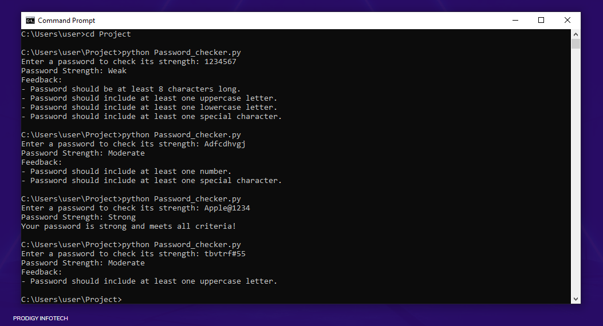

# Password Complexity Checker

This project is a Python tool designed to assess the strength of a password based on various criteria, including length, character variety, and common patterns. It was developed as part of my internship at Prodigy InfoTech in Cybersecurity and Ethical Hacking.

## Features

- **Length Check**: Ensures the password meets a minimum length requirement.
- **Character Variety**: Checks for the inclusion of uppercase and lowercase letters, numbers, and special characters.
- **Common Password Detection**: Identifies easily guessable passwords (e.g., "12345", "password") and marks them as weak.
- **User Feedback**: Provides feedback on how to strengthen the password.

## Getting Started

1. **Clone the repository**:
    ```bash
    git clone https://github.com/your-username/Password-Complexity-Checker.git
    ```

2. **Run the script**:
    ```bash
    python password_checker.py
    ```

## How It Works

The tool evaluates the password against a set of criteria and categorizes it as **Weak**, **Moderate**, or **Strong**. It also provides specific feedback on how to improve the password’s strength if necessary.

## Example



## Technologies Used

- **Python**: The core programming language used for the tool.

## Contributing

If you'd like to contribute to this project, please open an issue or submit a pull request.

## License

This project is licensed under the MIT License - see the [LICENSE](LICENSE) file for details.
